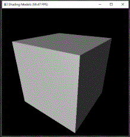

# Hello cube

The goal of this section is to give a brief introduction to Taichi THREE. We will start by setting up a scene, with a simple cube, as THREE.js tutorial starts from too.
A working example is provided at the bottom of the page in case you get stuck and need help.


## Before we get started

First of all, make sure you have installed `taichi_three` (see [README.md](/README.md)), then import the it as a package:

```py
import taichi_three as t3
```

## Creating the scene

To actually be able to display anything with Taichi THREE, we need three things: scene, camera, and model, so that we can render the scene with camera.

Scene - the collection of all renderer resources.
Camera - take images from scene and display it on the screen.
Model - the object to be displayed in the scene, a triangle in this case.

Let's add the scene and camera now:

```py
scene = t3.Scene()
camera = t3.Camera()
scene.add_camera(camera)
```

## Add a cube as model

To make the model display the geometry we desired (cube in this case), we need to load some geometry data into it. To do so:


```py
obj = t3.Geometry.cube()                 # create a cube geometry object
model = t3.Model(t3.Mesh.from_obj(obj))  # create a mesh model from a geometry object
scene.add_model(model)
```

?> Finally, don't forget to **add** the model and camera to scene.

## Adding lights

Running the code above will gives you a very completely dark image. You should also get an warning message `Warning: no lights` in this situation.

So, to make our `t3.Model` visible, we should add a **light** source:

```py
light = t3.Light(dir=[-0.2, -0.6, -1.0])  # parallel light with a specific direction
scene.add_light(light)
```

## Visualizing the scene

If you copied the code from above and run, you wouldn't be able to see anything. This is because we're not actually rendering anything yet. For that, we need what's called an animate loop.

The good news is that we've already intergrated a simple GUI system that is able to render animation in real-time, to utilize it, just:

```py
gui = t3.GUI('Hello Triangle')
while gui.running:
    scene.render()
    gui.set_image(camera.img)  # blit the image captured by `camera` to screen
    gui.show()
```

Till now running the code successfully show gives you an white rectangle in the middle of screen:

## Controling the camera with mouse

Currently we're looking directly at **the front face** of the cube, which is the default camera postion.
In order to see the other 6 faces of this cube, we need to move the camera by mouse.

To do so, we'll need to capture some mouse events in our GUI loop, and feed it into the `camera`:

```py
gui = t3.GUI('Hello Triangle')
while gui.running:
    gui.get_event(None)     # receive mouse and key events from GUI
    camera.from_mouse(gui)  # let the camera to process the mouse events
    scene.render()
    gui.set_image(camera.img)
    gui.show()
```

Now use **LMB to orbit** around the scene, **MMB to move** the center of view, **RMB to scale** the scene.
Feel like moving in 3D, right? Exactly what we want!




Nice job!

## Appendix

And here's the final code of this section:

[hello_cube.py](_media/hello_cube.py ':include :type=code')