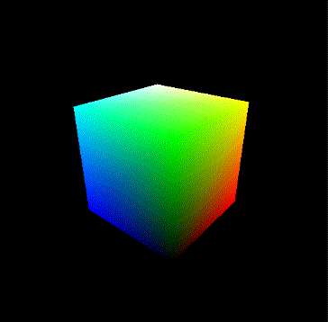

# Loading models

The goal of this section is to give a brief introduction to Taichi THREE's built-in model loader.
It's a handy function that allows you load OBJ files from disk.

Let's get started with a simple cube model ``cube.obj``. OBJ files are simply text files, copy and paste these contents:

[cube.obj](_media/cube.obj ':include :type=code')

Save it to `cube.obj`, in the same directory your Python code is in.

Or feel free to use your own OBJ files.

## Using `t3.readobj`

```py
obj = t3.readobj('/path/to/cube.obj')  # path to your cube.obj here
```

Its return value ``obj``, is a ``dict`` with these keys:

```py
obj['vp']  # vertex positions
obj['vt']  # vertex texture coordinates
obj['vn']  # vertex normals
obj['f']   # faces (each contain 3 indices)
```

Each of them is a [NumPy](www.numpy.org) array:

```py
>>> obj['vp']
array([[ 1.,  1., -1.],
       [ 1., -1., -1.],
       ...
       [-1.,  1.,  1.],
       [-1., -1.,  1.]])

>>> obj['f']          # containing both position, texture, normal indices, not what we want for t3.SimpleModel.faces
array([[[ 0,  0,  0],
        [ 4,  1,  0],
        [ 6,  2,  0]],

       ...

       [[ 0,  0,  5],
        [ 1, 12,  5],
        [ 5, 10,  5]]])
>>> obj['f'][:, :, 0]  # slice to get the position indices only
array([[0, 4, 6],
       [6, 2, 0],
       ...
       [5, 4, 0],
       [0, 1, 5]])
```

## Loading into `t3.SimpleModel`

You may then want to load these data into your `t3.SimpleModel` for displaying ``cube.obj``.
You may want to use a for-loop for assigning properties to each vertex/face:

```py
for i in range(len(obj['vp'])):
    model.pos[i] = obj['vp'][i]
for i in range(len(obj['f'])):
    model.faces[i] = obj['f'][i, :, 0]
```

It works but become low-effcient when the model is huge. Use ``from_numpy`` to ease that concern:

```py
model.pos.from_numpy(obj['vp']
model.faces.from_numpy(obj['f'][:, :, 0])
```

## To sum up

Combining with the knowledge from [previous section](hello_triangle.md), we have:

```py
import taichi_three as t3

obj = t3.readobj('cube.obj')

scene = t3.Scene()
camera = t3.Camera()
scene.add_camera(camera)

model = t3.SimpleModel(faces_n=len(obj['f']), pos_n=len(obj['vp']))
scene.add_model(model)

model.pos.from_numpy(obj['vp'])
model.faces.from_numpy(obj['f'][:, :, 0])

gui = t3.GUI('Loading Models')
while gui.running:
    scene.render()
    gui.get_event(None)
    camera.from_mouse(gui)
    gui.set_image(camera.img)
    gui.show()
```

Your screen is completely filled with white? Well, that's because the cube is so large that it takes up the whole screen, consider specify a `scale=` argument to scale it down:

```py
obj = t3.readobj('cube.obj', scale=0.6)
```

Or equivalently:

```py
model.pos.from_numpy(obj['vp'] * 0.6)
```

## Give color to vertices

Running the above code should gives you a completely white cube that you can hardly distinguish the borders.
Don't worry, let's assign some color to each vertex:

```py
model.pos.from_numpy(obj['vp'] * 0.6)
model.clr.from_numpy(obj['vp'] * 0.5 + 0.5)  # bind the RGB value of color with XYZ value of the vertex position for convinence
model.faces.from_numpy(obj['f'][:, :, 0])
```

Running it and move camera around by LMB, enjoy this beautiful cube!



?> Also note that all quadrilateral faces in the OBJ file will be automatically demoted into triangle faces for convinence.


## Appendix

And here's the final code of this section:

[loading_models.py](_media/loading_models.py ':include :type=code')